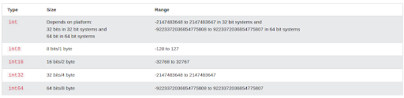
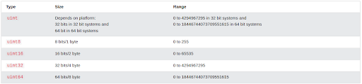

# Go Data Types

Go type is an important concept in programming. Data Types specifies the size and type of variables values .

Go statically typed, meaning that once a variable type is defined, it can only store data of that type .

Go has three basic types :

- **bool:** represent a boolean value and is either true and false.
- **Numeric:** represent integer types,floating point values, and complex types.
- **String:** represent a string value

### Boolean Data Type

A boolean data type is declared with the bool keyword and can only take the values true of false.Default value is false .

## Example

```go
package main
import ("fmt")

func main() {
  var b1 bool = true // typed declaration with initial value
  var b2 = true // untyped declaration with initial value
  var b3 bool // typed declaration without initial value
  b4 := true // untyped declaration with initial value

  fmt.Println(b1) // Returns true
  fmt.Println(b2) // Returns true
  fmt.Println(b3) // Returns false
  fmt.Println(b4) // Returns true
}
```

### Go integer data types

    Int data types are used to store a whole number without  decimals like -7,77,777,77777.

The integer data type has two categories :

- **signed integers :** can store both positive and negative values
- **Unsigned integers :** can only store non-negative values .

  **Tip:** The default type of integeris int. If you do not specify a type. the type will be int.

### Signed Integers

Signed integers, declared with one of the int keywords, can store both positive and negative values:

#### Example :

```go
package main
import ("fmt")

func main() {
  var x int = 500
  var y int = -4500
  fmt.Printf("Type: %T, value: %v", x, x)
  fmt.Printf("Type: %T, value: %v", y, y)
}
```

Go has five keywords/types of signed integers:



### Unsigned Integers

Unsigned integers, declared with one of the uint keywords, can only store non-negative values:

```go
package main
import ("fmt")

func main() {
  var x uint = 500
  var y uint = 4500
  fmt.Printf("Type: %T, value: %v", x, x)
  fmt.Printf("Type: %T, value: %v", y, y)
}
```

Go has five keywords/types of unsigned integers



## Go Float Data Types

the float data types are used to store positive and negative numbers with a decimal point like 35.3, -2.34 or 3597.34987

| Type    | Size   | Range                  |
| ------- | ------ | ---------------------- |
| float32 | 32bits | 3.4e+38 to 3.4e+38     |
| float64 | 64bits | -1.7e+304 to +1.7e+308 |

**Tip:** The default type for float is float64. If you do not specify a type, the type will be float64.

## The float32 keyword

Example:
This example shows how to declare some variables of type float32:

```go
package main
import ("fmt")

func main() {
  var x float32 = 123.78
  var y float32 = 3.4e+38
  fmt.Printf("Type: %T, value: %v\n", x, x)
  fmt.Printf("Type: %T, value: %v", y, y)
}
```

## The float64 Keyword

The float64 data type can store a larger set of numbers than float 32

### Example

this example shows to declare a variable of type float64

```go
package main
import ("fmt")

func main() {
  var x float64 = 1.7e+308
  fmt.Printf("Type: %T, value: %v", x, x)
}
```

## The String Data Type

The string data type is used to store a sequence of characters(text). String values must be surrounded by double quotes:

Examples:

```go
package main
import ("fmt")

func main() {
  var txt1 string = "Hello!"
  var txt2 string
  txt3 := "World 1"

  fmt.Printf("Type: %T, value: %v\n", txt1, txt1)
  fmt.Printf("Type: %T, value: %v\n", txt2, txt2)
  fmt.Printf("Type: %T, value: %v\n", txt3, txt3)
}
```
